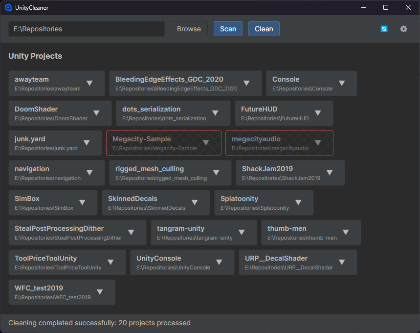

# Unity Cleaner

Because free drive space doesnt grow on trees

## Features

- Remove library and logs with a click
- Can add more folders to remove

## How

1. Select a directory
2. Click "Scan" to find all Unity projects in the directory
3. Select any to exclude from cleaning
4. Click clean to remove clear up some space

## Warning

**This tool permanently deletes files from your Unity projects.** Make sure your projects are using source control or have backups before cleaning.

## Defaults

By default, Unity Cleaner removes:
- Library folders
- Logs folders

Additional patterns can be configured in the Settings.

## Requirements

- .NET 9.0 or higher
- Windows, macOS, or Linux operating system
- only tested on windows

## Finally

This tool is provided as is, use at your own risk.
